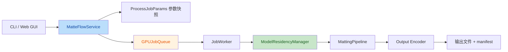

# MatteFlow Service / Queue / Model Residency 重构开发计划

> 本文档用于把 EZ-CorridorKey 代码 review 中总结出的 P0-P2 借鉴点，转化为 MatteFlow 后续可执行的重构任务清单。
> 本文只定义开发计划，不代表相关源码已经实现。

## 1. 背景

当前 MatteFlow 已具备视频、图片、序列帧输入能力，并集成了传统抠像、GVM、MatAnyone2、CorridorKey 等多种抠像路径。但随着模型和 GUI 能力增加，当前架构逐渐暴露出几个问题：

- GUI / CLI 与 `MattingPipeline` 绑定较直接，缺少稳定的业务服务层。
- 长任务缺少统一 job 抽象，后续做批处理、取消、续跑、状态显示会比较分散。
- 多个重模型缺少统一显存驻留策略，模型切换、释放和 OOM 恢复需要集中管理。
- 参数在 GUI 运行时容易和用户后续调整混在一起，缺少任务级参数快照。
- 缺少统一 manifest、错误语义、诊断和 GPU 状态查询能力。

EZ-CorridorKey 中比较成熟的参考点包括：

- `CorridorKeyService` 作为 UI 与推理引擎之间的唯一后端入口。
- `GPUJobQueue` 用稳定 job id、状态机、取消、去重和历史记录管理长任务。
- 单重模型驻留策略，切换模型前主动 offload、GC、清理 CUDA cache。
- 双视图、队列面板、参数快照、安装诊断、GPU/VRAM meter 等产品化能力。

## 2. 总体目标

建设 MatteFlow 的服务层、任务队列和模型驻留基础设施，让后续 GUI 批处理、任务取消、多模型切换、实时预览和诊断能力都能建立在稳定架构之上。

本轮重构不以改变抠像效果为目标，而是提升工程承载能力：

- 保持现有 CLI / Web GUI 行为兼容。
- 新增统一 `MatteFlowService`，逐步替代 GUI / CLI 直接调用 pipeline。
- 新增任务级参数快照，保证长任务运行期间参数稳定。
- 新增 GPU job queue，统一排队、取消、去重和状态管理。
- 新增模型驻留管理器，集中处理重模型加载、切换和释放。
- 为后续批处理面板、GPU 监控、环境诊断和 manifest 输出预留接口。

## 3. 目标架构



核心边界：

- `MatteFlowService`：业务入口，负责参数转换、输入校验、pipeline 调度、错误包装、manifest 写入。
- `ProcessJobParams`：不可变参数快照，表示一次提交任务的完整配置。
- `GPUJobQueue`：任务状态机和排队容器，不直接执行推理。
- `JobWorker`：消费队列任务，调用 service，更新 job 状态。
- `ModelResidencyManager`：管理重模型驻留、切换、释放和显存清理。
- `MattingPipeline`：继续专注实际抠像处理，但需要支持 `cancel_check`。

## 4. 文件规划

### 4.1 新增文件

- `src/matteflow/service.py`
  - 定义 `MatteFlowService`
  - 定义 `ProcessJobParams`
  - 定义 `ProcessOutputConfig`
  - 定义 `ProcessResult`
  - 封装对 `MattingPipeline` 的调用

- `src/matteflow/job_queue.py`
  - 定义 `JobType`
  - 定义 `JobStatus`
  - 定义 `GPUJob`
  - 定义 `GPUJobQueue`

- `src/matteflow/job_worker.py`
  - 定义最小后台 worker
  - 从 `GPUJobQueue` 取任务
  - 调用 `MatteFlowService.process()`
  - 更新任务进度、状态和错误

- `src/matteflow/model_residency.py`
  - 定义 `ActiveModel`
  - 定义 `ModelResidencyManager`
  - 提供 `ensure_model()`、`release_current()`、`release_all()`

- `src/matteflow/errors.py`
  - 定义 `MatteFlowError`
  - 定义 `InputValidationError`
  - 定义 `ModelLoadError`
  - 定义 `JobCancelledError`
  - 定义 `ProcessingError`

- `src/matteflow/manifest.py`
  - 输出 `matteflow_manifest.json`
  - 记录输入、参数、模型、版本、输出格式和耗时

- `src/matteflow/gpu_monitor.py`
  - 查询 GPU / VRAM 状态
  - 优先 NVML，fallback 到 `torch.cuda`

- `src/matteflow/diagnostics.py`
  - 环境诊断
  - 检查 Python、FFmpeg、torch、CUDA、模型路径、输出目录可写性

### 4.2 需要修改的现有文件

- `src/matteflow/pipeline.py`
  - `process()` 增加可选 `cancel_check`
  - 在解码后、逐帧处理前、后处理前、编码前检查取消
  - 保持不传 `cancel_check` 时行为不变

- `src/matteflow/__main__.py`
  - CLI 改为通过 `MatteFlowService` 处理
  - 保持现有参数和输出行为兼容

- `scripts/web_gui.py`
  - GUI 点击运行时创建 `ProcessJobParams`
  - 后续逐步接入 `GPUJobQueue`
  - 保持现有单任务运行入口兼容

- `src/matteflow/config.py`
  - 必要时补充 `to_dict()` / `from_dict()` 或快照转换函数
  - 不在第一批重构中大规模调整字段

### 4.3 新增测试文件

- `tests/test_service.py`
- `tests/test_job_queue.py`
- `tests/test_model_residency.py`
- `tests/test_pipeline_cancel.py`
- `tests/test_manifest.py`
- `tests/test_gpu_monitor.py`
- `tests/test_diagnostics.py`

## 5. P0 任务清单

P0 是架构地基，必须优先完成，并且每个任务都应单独提交。

### P0-1：新增 MatteFlowService

目标：

- 新增统一服务层，隔离 CLI / GUI 和 `MattingPipeline`。
- 第一阶段只做薄封装，不改变实际抠像算法。

开发内容：

- 新增 `src/matteflow/service.py`。
- 定义不可变 `ProcessJobParams`：
  - `input_path`
  - `output_dir`
  - `background_mode`
  - `quality_mode`
  - `use_ai`
  - `ai_model`
  - `config_overrides`
- 定义 `ProcessResult`：
  - `success`
  - `input_path`
  - `output_dir`
  - `background_mode`
  - `frame_count`
  - `processing_time`
  - `timings`
  - `error_message`
- `MatteFlowService.process(params, progress_callback=None, cancel_check=None)` 内部创建 `MattingConfig` 和 `MattingPipeline`。

测试要求：

- `tests/test_service.py::test_service_passes_snapshot_to_pipeline`
- `tests/test_service.py::test_service_returns_process_result`
- `tests/test_service.py::test_service_wraps_pipeline_errors`

验收标准：

- CLI / GUI 暂不强制接入也可以，但 service 单测必须通过。
- service 不导入重模型，基础 import 应保持轻量。

### P0-2：任务参数快照

目标：

- 保证任务提交瞬间参数冻结。
- 避免 GUI 中用户继续调整参数影响正在运行的任务。

开发内容：

- `ProcessJobParams` 使用 `@dataclass(frozen=True)`。
- 对 `MattingConfig` 中必要字段做深拷贝，特别是列表型字段如 `key_samples`。
- 禁止 service 执行中读取 GUI 当前控件状态。

测试要求：

- 创建 `ProcessJobParams` 后修改原始参数来源，断言 service 执行时仍使用旧值。
- 覆盖 `key_samples` 这类可变列表，避免浅拷贝污染。

验收标准：

- 输出结果、日志和 manifest 中参数都来自 job snapshot。

### P0-3：新增模型驻留管理器

目标：

- 为 GVM、MatAnyone2、CorridorKey、未来 BiRefNet 等重模型建立统一驻留策略。
- 同一时间只允许一个重模型驻留在 GPU。

开发内容：

- 新增 `src/matteflow/model_residency.py`。
- 定义 `ActiveModel`：
  - `NONE`
  - `GVM`
  - `MATANYONE2`
  - `CORRIDORKEY`
  - `BIREFNET`
  - `RVM`
  - `REMBG`
- 定义 `ModelResidencyManager`：
  - `active_model`
  - `ensure_model(model_type, loader)`
  - `release_current()`
  - `release_all()`
  - `_safe_offload(obj)`
- `_safe_offload()` 支持：
  - `obj.unload()`
  - `obj.to("cpu")`
  - `obj.cpu()`
  - 清空引用
  - `gc.collect()`
  - 可用时 `torch.cuda.empty_cache()`

测试要求：

- `A -> B` 切换时 A 被 offload。
- 重复请求 B 不重复加载。
- offload 抛异常时记录 warning，但不阻断后续释放。
- 无 torch 环境下不报错。

验收标准：

- 所有 AI 模型加载入口后续都能收敛到该 manager。

### P0-4：统一错误语义

目标：

- 把底层异常转换为用户可理解的错误。
- GUI / CLI 不直接显示 Python traceback。

开发内容：

- 新增 `src/matteflow/errors.py`。
- service 捕获常见异常：
  - 输入不存在
  - 无可读帧
  - 模型加载失败
  - CUDA OOM
  - 输出目录不可写
  - 用户取消
- 日志中保留完整异常链，返回给用户的是简洁错误。

测试要求：

- mock pipeline 抛出 `RuntimeError("CUDA out of memory")`。
- 断言 service 抛出或返回 `ProcessingError`，消息包含显存建议。

验收标准：

- 用户侧错误文案可读。
- 日志仍便于开发定位。

## 6. P1 任务清单

P1 是任务调度能力，依赖 P0 的 service 和错误语义。

### P1-1：新增 GPUJobQueue

目标：

- 为 GUI 批处理、取消、排队、状态显示提供统一基础。

开发内容：

- 新增 `src/matteflow/job_queue.py`。
- 定义 `JobType`：
  - `PROCESS_MEDIA`
  - `GVM_ALPHA`
  - `PREVIEW_REPROCESS`
- 定义 `JobStatus`：
  - `QUEUED`
  - `RUNNING`
  - `COMPLETED`
  - `CANCELLED`
  - `FAILED`
- 定义 `GPUJob`：
  - `id`
  - `job_type`
  - `input_path`
  - `params`
  - `status`
  - `error_message`
  - `current`
  - `total`
  - `request_cancel()`
  - `is_cancelled`
- 定义 `GPUJobQueue`：
  - `submit(job)`
  - `next_job()`
  - `start_job(job)`
  - `complete_job(job)`
  - `fail_job(job, error)`
  - `cancel_job(job)`
  - `cancel_all()`
  - `history_snapshot`

测试要求：

- 生命周期：queued -> running -> completed。
- 失败路径：queued -> running -> failed。
- 取消 queued job。
- 取消 running job。
- 同一 input + job type 去重。
- preview job latest-only 替换。

验收标准：

- 队列逻辑不依赖 GUI。
- 测试可以在无 GPU 环境运行。

### P1-2：新增 JobWorker

目标：

- 建立最小后台任务执行器。
- 先实现单 worker 串行执行，不急于并发。

开发内容：

- 新增 `src/matteflow/job_worker.py`。
- worker 从 `GPUJobQueue` 取 job。
- 对 `PROCESS_MEDIA` 调用 `MatteFlowService.process()`。
- 将 service 的 progress callback 写回 job。
- 捕获取消和失败状态。

测试要求：

- fake service 正常完成，job 变成 `COMPLETED`。
- fake service 抛异常，job 变成 `FAILED`。
- fake service 分步执行时取消，job 变成 `CANCELLED`。

验收标准：

- 后续 GUI 可以只关注 job 状态，而不是直接管理 pipeline。

### P1-3：Pipeline 支持 cancel_check

目标：

- 长视频和序列帧处理可以帧级取消。

开发内容：

- 修改 `MattingPipeline.process()` 签名：
  - 增加 `cancel_check=None`
  - 保持现有调用兼容
- 在关键阶段调用取消检查：
  - 解码完成后
  - matte 生成循环前
  - refine 前
  - despeckle 前
  - stabilizer 前
  - encode 前
- 检测取消后抛出 `JobCancelledError`。

测试要求：

- mock 多帧 pipeline，在第 2 帧取消。
- 断言不会继续执行后续阶段。
- 不传 `cancel_check` 时现有测试保持通过。

验收标准：

- 取消响应粒度不超过一个阶段或一帧。

### P1-4：运行 Manifest

目标：

- 每次输出目录生成可复现的处理记录。

开发内容：

- 新增 `src/matteflow/manifest.py`。
- 输出 `matteflow_manifest.json`。
- 记录字段：
  - `schema_version`
  - `input_path`
  - `output_dir`
  - `background_mode`
  - `quality_mode`
  - `use_ai`
  - `ai_model`
  - `actual_params`
  - `frame_count`
  - `timings`
  - `matteflow_version`
  - `created_at`

测试要求：

- service 完成后写入 manifest。
- manifest 参数与 `ProcessJobParams` 一致。
- 写 manifest 失败不应导致主处理失败，但要记录 warning。

验收标准：

- 用户反馈问题时可以附带 manifest。

## 7. P2 任务清单

P2 是产品化和可观测性增强，依赖前两阶段。

### P2-1：GPU / VRAM 监控

目标：

- 给 GUI 和 service 提供轻量显存查询。

开发内容：

- 新增 `src/matteflow/gpu_monitor.py`。
- 优先使用 `pynvml`。
- fallback 到 `torch.cuda`。
- 无 GPU 或查询失败返回：
  - `available=False`
  - 不抛异常

测试要求：

- mock NVML 成功。
- mock torch fallback。
- mock 无 GPU。
- mock 查询异常。

验收标准：

- 查询失败不影响处理。
- 基础 import 不强依赖 torch。

### P2-2：环境诊断

目标：

- 在运行前提示缺失依赖和修复建议。

开发内容：

- 新增 `src/matteflow/diagnostics.py`。
- 定义 `DiagnosticResult`：
  - `name`
  - `ok`
  - `severity`
  - `message`
  - `suggestion`
- 诊断项：
  - Python 版本
  - FFmpeg 可用性
  - torch import
  - CUDA 可用性
  - 模型路径
  - 输出目录可写

测试要求：

- 缺 FFmpeg 时返回明确安装建议。
- 缺 torch 时基础功能仍可运行，但 AI 功能提示不可用。
- 输出目录不可写时提示换目录。

验收标准：

- GUI / CLI 可以复用同一诊断结果。

### P2-3：GUI 队列面板

目标：

- 在 Web GUI 中展示任务列表、状态、进度和取消操作。

开发内容：

- 在 `scripts/web_gui.py` 中先实现轻量队列视图。
- 支持：
  - 添加任务
  - 运行全部
  - 取消当前
  - 清空完成任务
  - 显示 queued / running / completed / failed / cancelled

测试要求：

- GUI 层先以手动验收为主。
- 核心行为依赖 `tests/test_job_queue.py` 和 `tests/test_job_worker.py`。

验收标准：

- 多个输入可以排队串行处理。
- 取消当前任务后队列可继续处理后续任务。

### P2-4：Service 接入 CLI / GUI

目标：

- 让 CLI 和 Web GUI 的实际处理统一走 service。

开发内容：

- 修改 `src/matteflow/__main__.py`。
- 修改 `scripts/web_gui.py`。
- 保持现有参数、默认值、输出结构兼容。
- CLI 仍支持视频、图片、序列帧。

测试要求：

- CLI help 测试保持通过。
- CLI 参数解析后构造正确 `ProcessJobParams`。
- Web GUI 默认值测试保持通过。

验收标准：

- 用户感知行为不变。
- 内部调用路径统一。

## 8. 推荐实施顺序

### 第 1 批：Service 地基

- P0-1：新增 `MatteFlowService`
- P0-2：任务参数快照
- P0-4：统一错误语义

建议提交：

```bash
git commit -m "feat: add matteflow service layer"
```

### 第 2 批：模型驻留

- P0-3：新增 `ModelResidencyManager`
- 将 GVM / MatAnyone2 / CorridorKey 的加载入口逐步接入 manager

建议提交：

```bash
git commit -m "feat: add model residency manager"
```

### 第 3 批：队列

- P1-1：新增 `GPUJobQueue`
- P1-2：新增最小 `JobWorker`

建议提交：

```bash
git commit -m "feat: add gpu job queue"
```

### 第 4 批：取消和可复现

- P1-3：Pipeline 支持 `cancel_check`
- P1-4：运行 manifest

建议提交：

```bash
git commit -m "feat: support cancellable processing jobs"
```

### 第 5 批：产品化增强

- P2-1：GPU / VRAM 监控
- P2-2：环境诊断

建议提交：

```bash
git commit -m "feat: add runtime diagnostics"
```

### 第 6 批：GUI 接入

- P2-3：GUI 队列面板
- P2-4：Service 接入 CLI / GUI

建议提交：

```bash
git commit -m "feat: route gui and cli through service"
```

## 9. 测试策略

### 单元测试优先级

- `tests/test_service.py`
  - service 参数快照
  - pipeline mock 调用
  - 错误包装

- `tests/test_model_residency.py`
  - 模型切换
  - 重复模型复用
  - offload 异常容错

- `tests/test_job_queue.py`
  - 队列生命周期
  - 去重
  - 取消
  - preview latest-only

- `tests/test_pipeline_cancel.py`
  - 不传 `cancel_check` 兼容
  - 传 `cancel_check` 后可中断

- `tests/test_manifest.py`
  - manifest 写入
  - 参数一致性

### 回归测试

每批提交前至少运行：

```bash
python -m pytest
```

如果依赖较重，可先运行聚焦测试：

```bash
python -m pytest tests/test_service.py tests/test_job_queue.py tests/test_model_residency.py -v
```

### 手动验收

- CLI 单图处理。
- CLI 视频处理。
- CLI 序列帧目录处理。
- Web GUI 单任务处理。
- Web GUI 修改参数后再提交任务，确认正在运行任务不受后续参数调整影响。
- AI 模型切换后观察显存是否释放。

## 10. 风险与约束

### 风险 1：一次性改动过大

规避：

- 严格按 P0 / P1 / P2 分批提交。
- 第一批只做薄 service，不改 GUI 行为。

### 风险 2：模型驻留接入影响现有抠像结果

规避：

- 初期只管理生命周期，不改变模型输出。
- 对 GVM / MatAnyone2 / CorridorKey 分别加 mock 测试和真实轻量导入测试。

### 风险 3：取消逻辑破坏 pipeline 兼容性

规避：

- `cancel_check` 必须是可选参数。
- 不传时所有现有测试应保持通过。

### 风险 4：GUI 队列和 Gradio 状态同步复杂

规避：

- 先完成无 GUI 的 queue / worker 单元测试。
- GUI 只展示状态，不承担核心状态管理。

### 风险 5：重依赖 import 影响基础测试

规避：

- `service.py`、`job_queue.py`、`diagnostics.py` 基础 import 不应主动加载 torch / timm / diffusers。
- 重模型仅在实际 `ensure_model()` 或 pipeline 推理路径中 lazy import。

## 11. 最小可交付版本

第一阶段最小可交付不要求完整 GUI 队列，只要求：

- `MatteFlowService.process()` 可独立调用。
- `ProcessJobParams` 是不可变快照。
- `ModelResidencyManager` 可单测验证模型切换释放。
- `GPUJobQueue` 可单测验证生命周期、取消、去重。
- `MattingPipeline.process()` 支持可选 `cancel_check`。
- 全量测试通过。

达到以上状态后，再进入 Web GUI 队列面板和产品化诊断增强。

## 12. 与当前 MatteFlow 能力的关系

本计划不替代现有 PRD，也不改变当前抠像算法目标。它是现有高质量抠像能力继续扩展的工程地基：

- 当前 `MattingPipeline` 继续负责抠像质量。
- 新增 service / queue / residency 负责工程稳定性。
- 后续 UI 交互、批处理、模型切换和诊断能力都建立在该地基上。

