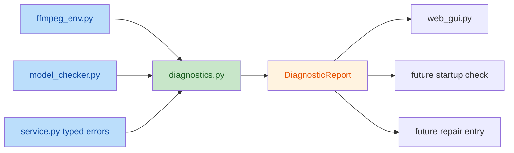

# P0-3 建立诊断中心 Spec

> 项目：`MatteFlow`
> 
> 范围：`P0-3 建立诊断中心`
> 
> 日期：`2026-05-20`
> 
> 状态：`Draft for Review`

## 1. 背景

当前 `MatteFlow` 已经具备以下几类与“诊断”相关的散点能力：

- `src/matteflow/ffmpeg_env.py` 负责 `ffmpeg / ffprobe` 发现与部分状态判断
- `src/matteflow/utils/model_checker.py` 负责模型可用性与部分 runtime 导入检查
- `src/matteflow/service.py` 会把部分底层异常包装成更可读的 `ProcessingError`
- `scripts/web_gui.py` 中存在若干直接面向用户的错误文案与状态文本

这些能力已经能覆盖部分问题，但仍存在明显不足：

- 规则分散：不同模块各自判断、各自拼装错误文本，缺少统一出口
- 语义不统一：有的返回布尔值，有的返回字典，有的抛异常，有的直接输出字符串
- GUI 难复用：`web_gui.py` 很难区分“阻断问题”“警告问题”“可降级继续运行的问题”
- CLI 与 GUI 诊断体验不一致：当前没有统一的结构化诊断结果模型
- 后续扩展困难：`P0-4` 启动自检、repair 入口、首启向导如果直接复用现状，会继续扩大耦合和重复逻辑

因此，需要先建设一个只聚焦“诊断中心”的基础层，把环境检查、运行时错误归因和 GUI 展示所依赖的诊断语义统一起来。

## 2. 目标

本期 `P0-3` 的目标不是修复环境，也不是新增完整安装向导，而是建立一个统一的“诊断中心”基础设施，达成以下结果：

- 统一表达 `FFmpeg/FFprobe`、模型缺失、runtime 导入失败、CUDA OOM、输入无效、输出目录不可写等问题
- 让 GUI 能够消费结构化诊断结果，而不是直接匹配零散字符串
- 让 service / checker / env discovery 只负责提供事实和 typed error，不直接承担最终用户文案职责
- 为后续 `P0-4` 启动自检与 repair 入口预留稳定接口

## 3. 非目标

本期明确不做以下事项：

- 不实现首启向导
- 不实现完整 repair 流程
- 不修改 `scripts/configure_ffmpeg.ps1` 的主流程设计
- 不引入新的桌面 GUI 框架
- 不重构 `MattingPipeline` 的核心抠像算法
- 不在本期解决所有模型下载与安装问题

这些能力要么属于 `P0-4`，要么属于后续更高阶段的产品化能力；本期仅做结构化诊断中心。

## 4. 设计原则

### 4.1 事实与解释分离

- `ffmpeg_env.py`、`model_checker.py`、`service.py` 优先产出“事实”或“typed error”
- `diagnostics.py` 负责把事实转换为诊断结论
- `web_gui.py` 负责将诊断结论渲染成用户可见提示

### 4.2 诊断优先结构化，文案次之

- 不再以“拼一段最终错误字符串”为主
- 诊断对象要先具备稳定字段，再由 GUI 决定如何展示

### 4.3 分级明确

本期至少区分以下三类问题：

- `error`：阻断当前流程，用户不应继续运行
- `warning`：可以继续运行，但结果可能受影响或需用户留意
- `info`：状态说明或降级提示，不阻断流程

### 4.4 不破坏现有主流程

- 现有 `ffmpeg_env`、`model_checker`、`service` 的主要职责不应被推翻
- 本期新增内容应主要以封装和适配为主，而非大规模重写

## 5. 当前问题拆解

### 5.1 FFmpeg 相关问题

当前 `src/matteflow/ffmpeg_env.py` 已能产出如下信息：

- 是否找到 `ffmpeg`
- 是否找到 `ffprobe`
- 两者是否完整成对
- 是否需要下载完整工具链
- 来源于 `PATH`、公共目录还是 `imageio_ffmpeg`

问题在于：

- 它当前返回的是偏工具层的 discovery 结果，而不是用户级诊断
- GUI 层需要自行决定什么是“缺失”“不完整”“可继续”

### 5.2 模型检查相关问题

当前 `src/matteflow/utils/model_checker.py` 已覆盖：

- 各模型路径是否存在
- 某些 runtime 是否可导入
- 某些模型是否依赖 CUDA

问题在于：

- 返回字典结构不稳定，偏展示而非协议
- 可用性判断和最终 UI 选项耦合较深
- 原因字段只是简单字符串，不具备 code / severity / recovery guidance

### 5.3 处理期错误相关问题

当前 `src/matteflow/service.py` 已对 OOM 等错误做了有限包装，但仍存在：

- 只有 `ProcessingError`，缺少更完整的诊断归类
- GUI 无法基于稳定 code 做分支
- 不同来源的异常没有统一映射方式

### 5.4 GUI 层问题

当前 `scripts/web_gui.py` 主要消费字符串结果，问题在于：

- 很难统一展示错误、警告、信息
- 不利于后续引入启动自检、状态页或 repair 入口
- 测试只能断言字符串片段，缺少稳定结构

## 6. 目标架构

核心思路：

- `diagnostics.py` 成为统一诊断汇聚层
- 其他模块尽量只暴露 discovery 事实、checker 事实或 typed error
- `DiagnosticReport` 作为 GUI 与后续启动自检的稳定协议

## 7. 数据模型设计

本期在 `src/matteflow/diagnostics.py` 中引入以下结构。

### 7.1 DiagnosticSeverity

用于区分问题等级：

- `ERROR`
- `WARNING`
- `INFO`

### 7.2 DiagnosticCode

建议使用稳定 code，避免 GUI 依赖文案判断。首批至少覆盖：

- `FFMPEG_NOT_FOUND`
- `FFPROBE_NOT_FOUND`
- `FFMPEG_INCOMPLETE_TOOLCHAIN`
- `MODEL_MISSING`
- `MODEL_RUNTIME_IMPORT_FAILED`
- `MODEL_GPU_REQUIRED`
- `GPU_OUT_OF_MEMORY`
- `INPUT_INVALID`
- `OUTPUT_DIR_UNWRITABLE`
- `UNKNOWN_PROCESSING_ERROR`

可以继续保留扩展空间，但本期只实现首批必要 code。

### 7.3 DiagnosticItem

建议字段如下：

- `code`: 稳定诊断码
- `severity`: `error / warning / info`
- `title`: 简短标题
- `summary`: 面向用户的一句话说明
- `details`: 解释文本，可选
- `actions`: 建议操作列表
- `evidence`: 原始证据字典，如路径、来源、模型名、原始错误文本
- `blocking`: 是否阻断当前流程

说明：

- `title` 和 `summary` 用于 GUI 简洁展示
- `details` 用于展开说明
- `actions` 用于后续 repair 或操作提示
- `evidence` 用于日志与调试，不要求 GUI 全量展示

### 7.4 DiagnosticReport

建议字段如下：

- `ok`: 是否无阻断问题
- `items`: `DiagnosticItem` 列表
- `blocking_count`
- `warning_count`
- `info_count`

说明：

- GUI、未来 startup check、后续 repair 都统一消费 `DiagnosticReport`

## 8. 模块职责设计

### 8.1 `src/matteflow/ffmpeg_env.py`

职责保持为“发现媒体工具事实”，不直接承担最终用户诊断职责。

本期要求：

- 保留当前 `discover_media_tools()` 等 API
- 不在这里写 GUI 级标题和修复建议
- 如有必要，可补充 discovery 结果字段，使其足够作为诊断输入

不建议：

- 在 `ffmpeg_env.py` 内直接拼装最终 GUI 报错文案

### 8.2 `src/matteflow/utils/model_checker.py`

职责调整为“提供模型可用性事实”，而不是直接承担 UI 选项文案与诊断文案的混合职责。

本期要求：

- 保留现有 `check_all_models()`、`get_available_models()` 基本能力
- 增加更稳定的事实字段或辅助接口，供 `diagnostics.py` 使用
- 逐步减少“UI 标签即业务语义”的耦合

建议新增能力：

- `collect_model_diagnostics()` 或类似事实输出接口
- 对模型缺失、GPU 要求、runtime 导入失败做稳定区分

### 8.3 `src/matteflow/service.py`

职责是“抛出 typed error 或包装底层异常”，并将处理阶段的事实传递给诊断中心。

本期要求：

- 保持 `ProcessingError` 作为对外稳定错误之一
- 通过 `diagnostics.py` 提供异常映射函数，把 OOM 等错误转换为 `DiagnosticItem`
- 不要求本期将所有异常类型都拆为新异常类，但需要有统一映射入口

### 8.4 `src/matteflow/diagnostics.py`

这是本期核心新增文件。

建议职责分成 4 层函数：

- `from_media_tools(discovery_result) -> DiagnosticReport`
- `from_model_status(model_status_dict) -> DiagnosticReport`
- `from_exception(exc, context=None) -> DiagnosticReport`
- `merge_reports(*reports) -> DiagnosticReport`

建议同时提供：

- `report_to_user_text(report)`  
  用于 CLI 或简单文本场景

但 GUI 侧应优先直接消费结构化结果，而不是再反向解析文本。

### 8.5 `scripts/web_gui.py`

本期只做消费层改造，不做复杂 GUI 大重构。

要求：

- 对 FFmpeg 相关失败或模型相关失败，优先显示结构化诊断结果
- 状态区或错误区可以根据 `severity` 做分级
- 阻断类问题不得伪装成普通状态文本

不要求：

- 本期不做完整 diagnostics 面板
- 本期不做首启 wizard

## 9. 诊断来源与数据流

### 9.1 环境诊断数据流

适用场景：

- GUI 初始化阶段
- 用户切换模型时
- 用户运行任务前

数据流：

1. `ffmpeg_env.py` 提供媒体工具 discovery 结果
2. `model_checker.py` 提供模型可用性结果
3. `diagnostics.py` 把这些事实转换为 `DiagnosticReport`
4. GUI 展示阻断问题或警告问题

### 9.2 处理期异常诊断数据流

适用场景：

- service 运行时异常

数据流：

1. `service.py` 捕获底层异常并做基础包装
2. `diagnostics.py.from_exception()` 将异常映射为 `DiagnosticReport`
3. GUI 根据诊断等级显示错误与建议动作

## 10. GUI 展示规则

本期不做复杂页面，但必须定义稳定展示规则。

### 10.1 展示层级

- `error`：使用明显错误状态文案，阻断继续运行
- `warning`：允许继续，但需要显示提示
- `info`：用于说明降级路径或当前状态

### 10.2 展示内容

对于每个 `DiagnosticItem`，GUI 至少展示：

- `title`
- `summary`
- `actions` 的前 1-3 条

可选展示：

- `details`
- `evidence`

### 10.3 多问题合并规则

- 同一份 `DiagnosticReport` 可能包含多个 item
- GUI 默认优先展示阻断级 `error`
- 同类问题不得重复刷屏
- 多个阻断问题可合并为一个列表区域

## 11. 文件改动清单

### 11.1 新增文件

- `src/matteflow/diagnostics.py`

### 11.2 重点修改文件

- `src/matteflow/ffmpeg_env.py`
- `src/matteflow/utils/model_checker.py`
- `src/matteflow/service.py`
- `scripts/web_gui.py`

### 11.3 重点测试文件

- `tests/test_ffmpeg_env.py`
- `tests/test_model_checker_runtime.py`
- `tests/test_service.py`
- 建议新增：`tests/test_diagnostics.py`

## 12. 测试设计

### 12.1 单元测试

新增 `tests/test_diagnostics.py`，至少覆盖：

- `ffmpeg only` -> `FFPROBE_NOT_FOUND`
- `ffmpeg/ffprobe 都缺失` -> `FFMPEG_NOT_FOUND`
- 模型文件缺失 -> `MODEL_MISSING`
- vendored runtime 导入失败 -> `MODEL_RUNTIME_IMPORT_FAILED`
- OOM 异常 -> `GPU_OUT_OF_MEMORY`
- 未知异常 -> `UNKNOWN_PROCESSING_ERROR`
- `merge_reports()` 去重和统计逻辑

### 12.2 现有测试补充

- `tests/test_ffmpeg_env.py`  
  保持 discovery 事实层测试，不把它改成 GUI 文案测试

- `tests/test_model_checker_runtime.py`  
  增加对模型诊断事实来源的稳定断言

- `tests/test_service.py`  
  增加 service 异常映射到诊断中心的覆盖

### 12.3 GUI 聚焦测试

如本期改动足够集中，可增加或扩展 GUI 相关聚焦测试，至少验证：

- 阻断类诊断会明确显示错误提示
- 警告类诊断不会被误判为成功
- GUI 不再仅依赖字符串模糊匹配

## 13. 验收标准

本期完成后，必须满足：

1. 常见环境问题可以被归类为结构化诊断，不再只输出 raw traceback
2. GUI 能按 `error / warning / info` 做最小分级展示
3. `ffmpeg_env.py`、`model_checker.py`、`service.py` 与 GUI 的职责边界更清晰
4. 诊断中心能够为 `P0-4` 启动自检提供可复用接口
5. 现有 `ffmpeg`、`model checker`、`service` 相关测试不回归

建议附加达成：

6. CLI 场景也可以通过 `report_to_user_text()` 获得统一风格的诊断文本

## 14. 与 P0-4 的边界

为避免范围膨胀，本期与 `P0-4` 的边界明确如下：

### 本期做

- 结构化诊断模型
- 诊断映射规则
- GUI 最小分级展示
- 未来 repair / startup check 的接口预留

### 本期不做

- 首次启动向导
- repair 按钮或一键修复流程
- 启动前完整阻断页
- 模型下载流程编排

这些能力统一留到 `P0-4` 再展开。

## 15. 风险与控制

### 风险 1：规则过早做成大而全

控制：

- 本期只覆盖高频问题，不追求一次纳入所有错误类型

### 风险 2：GUI 仍然依赖旧字符串

控制：

- GUI 适配时优先消费 `DiagnosticReport`
- 老字符串仅作为过渡 fallback

### 风险 3：`model_checker.py` 与 UI 耦合仍然过深

控制：

- 本期至少先新增“面向诊断”的稳定事实接口
- 不要求一次性彻底重写 UI choices 逻辑

## 16. 后续衔接

本 Spec 完成后，下一步的 Implementation Plan 应只聚焦：

- 新增 `diagnostics.py`
- 最小改造 `ffmpeg_env.py`
- 最小改造 `model_checker.py`
- 在 `service.py` 中接入异常诊断映射
- 在 `web_gui.py` 中接入诊断展示
- 补充 `tests/test_diagnostics.py` 与相关聚焦回归

不应在下一步计划中提前纳入 `P0-4` 的 repair 与 startup wizard。
