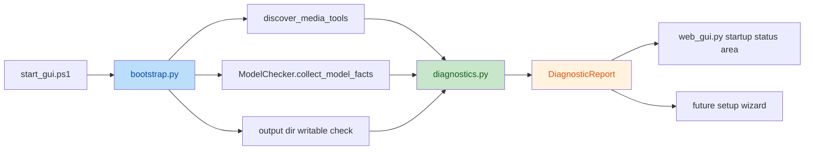

# P0-4 最小版启动自检 Spec

> 项目：`MatteFlow`
>
> 范围：`P0-4 启动自检与首启向导（第一阶段：最小版启动自检）`
>
> 日期：`2026-05-20`
>
> 状态：`Draft for Review`

## 1. 背景

`MatteFlow` 已完成 `P0-3 建立诊断中心` 的基础落地，当前已经具备以下能力：

- `src/matteflow/diagnostics.py` 能表达结构化诊断结果
- `src/matteflow/ffmpeg_env.py` 能产出 `ffmpeg / ffprobe` 发现事实
- `src/matteflow/utils/model_checker.py` 能产出模型可用性事实
- `src/matteflow/service.py` 与 `scripts/web_gui.py` 已能消费部分运行时 diagnostics

但当前启动链路仍然存在明显缺口：

- 用户通常要进入 GUI 并触发处理后，才知道环境是否完整
- `start_gui.ps1` 目前只负责 FFmpeg bootstrap，不负责统一启动检查
- GUI 没有一个专门的“启动状态”区域展示环境是否已就绪
- 缺模型、输出目录不可写、工具链不完整等问题，仍然偏后置暴露

因此，`P0-4` 的第一阶段不直接做完整首启向导，而是先做一个“最小版启动自检”，目标是在进入主工作流前就能统一收集和展示关键环境状态。

## 2. 目标

本期目标是建立一个最小但完整的启动检查闭环：

- 在启动阶段统一检查媒体工具、模型可用性和默认输出目录可写性
- 将这些检查结果汇总为一个 `DiagnosticReport`
- 在 Web GUI 顶部展示启动状态，而不是等到处理失败后才暴露问题
- 为第二阶段的首启向导保留稳定入口和数据协议

本期不是要做完整向导交互，而是先解决“进入工作流前是否已经就绪”的问题。

## 3. 非目标

本期明确不做以下事项：

- 不实现多步骤首启向导页面
- 不实现“一键修复”按钮或完整 repair 流程
- 不实现模型下载器
- 不实现更新检查
- 不改造 `MattingPipeline` 抠像逻辑
- 不引入新的 GUI 框架或页面流转系统

这些能力属于 `P0-4` 的后续阶段或更后续的产品化能力，不纳入本次最小版设计。

## 4. 设计原则

### 4.1 先检查，再进入主工作流

- 启动检查优先于实际处理
- 用户在点击运行前，就应该知道环境是否存在阻断项

### 4.2 复用 P0-3 诊断中心

- 启动自检不重新定义诊断协议
- 所有检查结果都统一汇总为 `DiagnosticReport`

### 4.3 阻断与降级分离

- 阻断问题需要明确标记，但不一定阻止整个 GUI 打开
- 对应功能不可用时，应允许用户先看到问题，再决定是否调整环境或路径

### 4.4 第一阶段只做最小展示

- GUI 顶部增加一个环境状态区即可
- 不做复杂弹窗、多步向导或设置页跳转

## 5. 启动检查范围

第一阶段启动检查只覆盖以下四类内容。

### 5.1 媒体工具完整性

检查项：

- 是否找到 `ffmpeg`
- 是否找到 `ffprobe`
- 是否为完整工具链

输出方式：

- 通过 `discover_media_tools()` 产出事实
- 再通过 `diagnostics.py` 转换为结构化诊断项

### 5.2 模型可用性

检查项：

- 核心模型文件是否存在
- runtime 是否可导入
- 是否存在 GPU 依赖但当前不满足的情况

输出方式：

- 通过 `ModelChecker.collect_model_facts()` 产出事实
- 再通过 `diagnostics.py` 转换为结构化诊断项

### 5.3 默认输出目录可写性

检查项：

- 默认输出目录是否存在或可创建
- 是否具备基本写权限

输出方式：

- 由新的启动检查 helper 生成事实
- 再通过 `diagnostics.py` 转换为 `OUTPUT_DIR_UNWRITABLE` 等诊断项

### 5.4 总体阻断状态

检查项：

- 当前是否存在任何 `blocking` diagnostics
- 是否只有 warning 或 info

输出方式：

- 汇总到一个统一 `DiagnosticReport`
- 供脚本层和 GUI 层共同消费

## 6. 目标架构



核心边界如下：

- `bootstrap.py` 负责调度启动检查，但不负责最终用户文案
- `diagnostics.py` 负责统一聚合与问题分级
- `web_gui.py` 负责展示启动检查结果
- `start_gui.ps1` 只负责调用检查、打印摘要和启动 GUI

## 7. 模块职责设计

### 7.1 `src/matteflow/bootstrap.py`

新增统一启动检查入口，例如：

- `collect_startup_report()`
- 或 `run_startup_checks()`

职责：

- 调用媒体工具 discovery
- 调用模型事实收集
- 调用默认输出目录可写性检查
- 聚合为一个 `DiagnosticReport`

要求：

- 不直接拼装最终展示文案
- 不依赖 GUI 框架
- 可以被脚本层和 GUI 层共同复用

### 7.2 `src/matteflow/diagnostics.py`

在现有基础上补充：

- 启动自检场景的聚合 helper
- 输出目录不可写的诊断项映射
- 启动摘要格式化所需的最小支持

要求：

- 保持与 `P0-3` 的数据模型兼容
- 不新增与 GUI 强耦合的逻辑

### 7.3 `src/matteflow/utils/model_checker.py`

继续作为模型事实来源。

要求：

- 复用 `collect_model_facts()`
- 不在本期承担 GUI 展示逻辑
- 保持现有运行时检查和 UI 选项逻辑不回归

### 7.4 `scripts/start_gui.ps1`

在现有 FFmpeg bootstrap 基础上补充：

- 调用 Python 侧启动检查入口
- 打印简洁摘要
- 将检查结果提供给 GUI 侧消费

第一阶段策略：

- 不在脚本层强制终止 GUI 启动
- 即使有阻断项，也允许 GUI 打开并明确展示问题

这样可以避免把“环境问题”和“无法打开 UI”叠加成更难排查的体验。

### 7.5 `scripts/web_gui.py`

新增页面顶部的启动状态区域。

展示规则：

- 有 `blocking` 项时显示错误区
- 只有 warning 时显示警告区
- 无阻断且无警告时显示“环境已就绪”

第一阶段只展示文本卡片，不实现 repair 按钮。

## 8. 数据流设计

### 8.1 启动阶段

1. `start_gui.ps1` 完成现有 FFmpeg bootstrap
2. 调用 `bootstrap.py` 中的启动检查入口
3. `bootstrap.py` 收集媒体工具、模型和输出目录事实
4. `diagnostics.py` 聚合为 `DiagnosticReport`
5. GUI 启动后读取并展示该 `DiagnosticReport`

### 8.2 运行阶段

- 运行时错误仍继续通过 `service.py` 和 `process_video()` 路径进入 `diagnostics.py`
- 启动自检只负责启动前已知问题
- 运行期 diagnostics 不与启动 report 混为一个流程

## 9. 阻断与降级规则

第一阶段建议采用如下规则：

- `FFmpeg` 或 `ffprobe` 不完整：
  - 视为阻断视频处理
  - 允许 GUI 打开
- 核心模型缺失：
  - 视为对应 AI 路径阻断
  - 允许进入 GUI 并改用其他路径或等待修复
- 输出目录不可写：
  - 视为运行阻断
  - 允许进入 GUI 修改输出目录
- 只有 warning / info：
  - 不阻断
  - 顶部展示提示即可

这套规则的重点不是“阻止用户进入页面”，而是“避免用户在未知状态下盲跑任务”。

## 10. 文件改动范围

### 10.1 重点新增

- `src/matteflow/bootstrap.py`

### 10.2 重点修改

- `src/matteflow/diagnostics.py`
- `src/matteflow/utils/model_checker.py`
- `scripts/web_gui.py`
- `scripts/start_gui.ps1`

### 10.3 视情况修改

- `src/matteflow/ffmpeg_env.py`

### 10.4 配套测试

- 建议新增：`tests/test_bootstrap.py`
- 修改：`tests/test_diagnostics.py`
- 修改：`tests/test_web_gui_defaults.py`

## 11. 测试设计

### 11.1 单元测试

新增或扩展以下测试：

- `tests/test_bootstrap.py`
  - 启动检查会正确聚合媒体工具、模型和输出目录结果
  - 存在阻断项时 `report.ok` 为 `False`
  - 只有 warning 时 `report.ok` 为 `True`

- `tests/test_diagnostics.py`
  - 输出目录不可写会映射为稳定诊断码
  - 启动检查聚合逻辑不会丢失已有 diagnostics 项

- `tests/test_web_gui_defaults.py`
  - GUI 能正确格式化启动检查报告
  - 不同 severity 会落到正确展示文案

### 11.2 聚焦回归

至少回归以下测试集：

```bash
pytest tests/test_ffmpeg_env.py tests/test_model_checker_runtime.py tests/test_diagnostics.py tests/test_web_gui_defaults.py -q
```

### 11.3 手动验收

至少验证以下场景：

- 正常环境下启动 GUI，顶部显示“环境已就绪”
- 缺 `ffprobe` 时启动 GUI，顶部显示明确错误说明
- 缺模型时启动 GUI，顶部显示模型缺失说明
- 默认输出目录不可写时，顶部显示改目录建议

## 12. 验收标准

本期完成的判定标准如下：

- 启动阶段能统一产出一份 `DiagnosticReport`
- GUI 顶部能稳定展示启动状态
- `FFmpeg`、模型、输出目录问题可以在进入主工作流前被识别
- 启动检查逻辑不破坏现有 FFmpeg bootstrap 和 GUI 主流程
- 不引入完整向导 UI，也不引入 repair 流程

## 13. 风险与约束

### 13.1 风险：脚本层和 GUI 层重复拼文案

规避：

- 文案尽量统一收敛到 Python 层
- 脚本层只打印简短摘要

### 13.2 风险：启动阻断策略过严

规避：

- 第一阶段不阻止 GUI 打开
- 优先让用户看到问题，而不是直接退出

### 13.3 风险：启动检查与运行时 diagnostics 混线

规避：

- 启动 report 与运行期 report 分开建模和消费
- 不在本期做复杂的诊断历史管理

## 14. 与第二阶段首启向导的关系

本 Spec 只覆盖第一阶段“最小版启动自检”。

后续第二阶段首启向导可以直接复用：

- `bootstrap.py` 的启动检查入口
- `DiagnosticReport` 数据协议
- GUI 顶部状态区的展示规则

届时再扩展为：

- 多步骤页面
- 继续 / 返回 / 修复提示
- 首次启动偏好设置
- repair 与下载入口

但这些都不属于本次实现范围。
