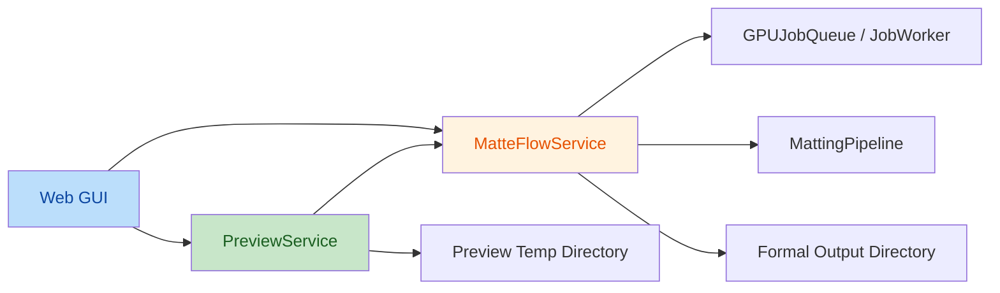

# P0-5 异步预览链路 Spec

> 项目：`MatteFlow`
>
> 范围：`P0-5 异步预览链路`
>
> 日期：`2026-05-20`
>
> 状态：`Draft for Review`

## 1. 背景

当前 `MatteFlow` 的预览能力主要集中在 `scripts/web_gui.py` 的 `process_video()` 中：

- GUI 收集参数后，直接提交正式处理任务
- 在同一条调用链里驱动 queue / worker 执行
- 在正式输出目录下生成 `preview.mp4` 和首帧预览图
- 将预览结果与正式处理结果一起返回给界面

现状已经能提供基本结果预览，但存在明显问题：

- 预览与正式处理共用一条混合链路，状态边界不清晰
- 快速切换参数时，旧请求结果可能覆盖新请求结果
- 预览产物写入正式输出目录，容易污染正式结果
- 当正式任务运行时，预览是否还能执行没有稳定协议
- 当前实现更接近“同步处理后顺带生成预览”，而不是“独立的异步预览服务”

因此，`P0-5` 的目标不是简单补一个新按钮，而是把预览能力升级为独立的协议层，使其具备稳定的 latest-only 语义、明确的 busy 行为和与正式处理分离的生命周期。

## 2. 目标

本期 `P0-5` 聚焦以下结果：

- 建立独立的 `PreviewService`
- 让预览请求具备 `latest-only` 语义
- 确保旧请求即使晚返回也不会覆盖最新预览
- 正式处理运行中，预览直接返回 `busy`，不尝试抢占执行
- 预览产物写入临时目录，不污染正式输出目录
- GUI 通过稳定的结构化响应消费预览结果

## 3. 非目标

本期明确不做以下事项：

- 不重写正式任务队列协议
- 不将预览任务并入 `GPUJobQueue` / `JobWorker` 的正式调度体系
- 不实现预览历史管理或预览持久化
- 不实现多 worker 并发预览
- 不在本期引入复杂的预览排队、延迟执行或正式任务结束后自动补跑预览
- 不保证本期同时完成预览性能优化

本期成功的标准是“预览行为稳定且边界清晰”，而不是“一次性做到最优性能”。

## 4. 设计原则

### 4.1 预览与正式处理边界分离

- 正式处理继续走 `MatteFlowService` + `GPUJobQueue` + `JobWorker`
- 预览走独立的 `PreviewService`
- 两者可以复用底层参数与处理能力，但不共享生命周期协议

### 4.2 latest-only 优先于真实取消

- 新预览请求到来时，旧请求应立即失效
- 即使旧请求底层未能即时停止，只要其结果不再是最新请求，就必须丢弃
- GUI 不参与“是否最新”的判断，统一由 `PreviewService` 决策

### 4.3 正式处理优先级高于预览

- 当正式处理任务正在运行时，预览不得尝试与其抢占 GPU
- 第一版稳定协议是：`正式处理中 -> 预览直接返回 busy`

### 4.4 预览产物与正式输出隔离

- 预览写入临时目录
- 正式处理继续写入正式输出目录
- 预览失败或过期不会污染正式产物

## 5. 当前问题拆解

### 5.1 混合调用链问题

当前 `process_video()` 同时承担：

- 参数收集
- 正式任务提交
- worker 驱动
- 预览视频生成
- 首帧对比图生成
- 状态文案拼装

这导致 GUI、预览协议和正式处理状态机耦合过深。

### 5.2 旧请求覆盖问题

当用户快速调整参数时，当前实现缺少稳定的请求序号或 revision 概念。即使后发请求代表更符合用户意图的状态，也无法保证旧请求结果不会覆盖最新请求。

### 5.3 输出污染问题

当前预览文件跟随正式处理输出目录生成，可能导致：

- 预览文件覆盖正式结果中的同名文件
- 用户尚未正式运行时，输出目录已出现半成品
- 多次预览难以保证文件来源与当前参数一致

### 5.4 忙碌协议缺失

当正式任务运行时，预览该不该执行、是排队、取消还是拒绝，目前缺少明确规则。若不先确定该规则，后续实现会持续摇摆。

## 6. 目标架构



核心思路：

- GUI 不再自行维护 latest-only 规则
- `PreviewService` 成为唯一的预览协议层
- 正式任务状态仍由 queue / worker 管理
- 预览结果与正式结果分目录、分状态、分生命周期

## 7. 数据模型设计

本期建议在 `src/matteflow/preview_service.py` 中定义以下结构。

### 7.1 PreviewStatus

第一版至少包括：

- `ACCEPTED`
- `COMPLETED`
- `BUSY`
- `CANCELLED`
- `FAILED`
- `STALE`

其中：

- `BUSY` 表示因为正式任务运行中而未执行
- `STALE` 表示请求已过期，结果必须丢弃，但这不是失败

### 7.2 PreviewRequest

建议字段：

- `input_path`
- `params`
- `request_id`
- `temp_dir`

说明：

- `params` 复用 `ProcessJobParams`
- `request_id` 是 latest-only 的核心标识
- `temp_dir` 用于隔离预览产物

### 7.3 PreviewArtifacts

建议字段：

- `preview_video`
- `input_preview`
- `output_preview`

说明：

- 仅包含 GUI 展示所需的最小产物
- 不承载 ZIP、透明 PNG 下载等正式处理产物

### 7.4 PreviewResponse

建议字段：

- `request_id`
- `status`
- `message`
- `artifacts`
- `diagnostics_text`

说明：

- GUI 统一消费 `PreviewResponse`
- `diagnostics_text` 用于错误场景快速展示

## 8. 接口设计

### 8.1 PreviewService

建议接口：

```python
class PreviewService:
    def __init__(self, service_factory, busy_check, temp_root: Path) -> None:
        ...

    def submit_preview(self, input_path: str | Path, params: ProcessJobParams) -> PreviewResponse:
        ...

    def cancel_active_preview(self) -> bool:
        ...
```

职责：

- 生成新的 `request_id`
- 维护当前最新请求
- 在正式任务运行时直接返回 `BUSY`
- 执行预览渲染
- 校验结果是否仍然属于最新请求
- 将旧结果标记为 `STALE`

### 8.2 busy_check

`PreviewService` 不直接读取队列实现细节，而是由外层注入 `busy_check`。

建议语义：

```python
def busy_check() -> bool:
    ...
```

只回答一个问题：

- 当前是否存在运行中的正式处理任务

### 8.3 GUI 侧适配

`scripts/web_gui.py` 中建议新增：

- `_default_preview_service_factory()`
- `request_preview(...)`
- `_preview_response_to_ui(...)`

GUI 只负责：

- 组装 `ProcessJobParams`
- 调用 `PreviewService.submit_preview()`
- 根据 `PreviewResponse` 更新界面

GUI 不应再自行判断：

- 结果是否过期
- 是否需要丢弃旧请求结果
- 正式任务忙碌时是否还能偷偷跑预览

### 8.4 与 service 的衔接

第一版推荐策略：

- 先复用现有 `MatteFlowService.process()`
- 由 `PreviewService` 指定临时输出目录
- 若后续确认当前预览路径过重，再考虑抽专门的轻量预览入口

这样可以降低一次性改动范围，并与 `P0` 的稳定优先原则一致。

## 9. 请求生命周期

单个预览请求的数据流建议如下：

1. GUI 发起预览请求
2. `PreviewService` 生成新的 `request_id`
3. 调用 `busy_check()`
4. 若正式任务忙碌，直接返回 `BUSY`
5. 若不忙碌，将该请求登记为当前最新请求
6. 执行预览处理并写入临时目录
7. 处理完成后再次校验 `request_id` 是否仍为最新请求
8. 若仍为最新，返回 `COMPLETED`
9. 若已被新请求取代，返回 `STALE`，GUI 丢弃结果

这条链路的关键保证是：

- “是否成功取消旧任务”不是唯一依赖
- “旧结果不得覆盖新结果”才是核心协议

## 10. 文件改造清单

### 10.1 新增文件

- `src/matteflow/preview_service.py`

职责：

- 定义预览协议数据模型
- 实现 latest-only 语义
- 实现 `busy` / `stale` / `failed` 等稳定返回
- 管理预览临时输出目录

### 10.2 重点修改文件

- `scripts/web_gui.py`
  - 新增预览服务工厂
  - 新增预览请求入口
  - 新增预览响应到 UI 的适配逻辑
  - 去掉当前 `process_video()` 中混合的预览调度职责

- `src/matteflow/service.py`
  - 第一版仅做最小适配
  - 保证预览复用现有参数与异常包装能力

- `src/matteflow/pipeline.py`
  - 仅在必要时为临时目录输出提供最小兼容
  - 不在本期引入重型双模式重构

### 10.3 尽量不动的文件

- `src/matteflow/job_queue.py`
- `src/matteflow/job_worker.py`

本期原则：

- 正式任务队列继续只服务正式处理
- 不把 `P0-5` 的职责回流到 `P0-2`

## 11. 测试设计

### 11.1 新增测试

新增 `tests/test_preview_service.py`，至少覆盖：

- 正式任务运行中时返回 `BUSY`
- 第一次请求成功完成并返回 `COMPLETED`
- 第二次请求到来后，第一次请求结果变为 `STALE`
- 旧请求晚完成时不会返回可展示结果
- 预览执行异常时返回 `FAILED`
- `cancel_active_preview()` 的取消或结果失效语义

### 11.2 重点修改测试

- `tests/test_web_gui_preview.py`
  - 验证 GUI 对 `PreviewResponse` 的消费逻辑
  - 验证 `BUSY` 不会覆盖已有预览
  - 验证 `COMPLETED` 才会刷新预览结果
  - 验证 `STALE` 会被静默丢弃
  - 验证错误状态显示结构化提示

- `tests/test_web_gui_queue_integration.py`
  - 验证预览请求不会进入正式队列
  - 验证正式任务状态不受预览污染

### 11.3 选择性补充测试

- `tests/test_service.py`
  - 仅在必要时补充预览复用 `ProcessJobParams` 与异常映射的 focused case

### 11.4 尽量不动的测试

- `tests/test_job_queue.py`
- `tests/test_job_worker.py`

除非发生正式队列协议回归，否则不应因 `P0-5` 大改这些测试。

## 12. GUI 展示规则

### 12.1 BUSY

- 显示“正式处理中，预览暂不可用，请等待完成或取消后重试”
- 不刷新当前已有预览

### 12.2 COMPLETED

- 更新预览视频、输入预览图和输出预览图
- 更新状态文本为当前最新请求的成功信息

### 12.3 STALE

- 不显示错误
- 不刷新任何预览组件
- 直接丢弃结果

### 12.4 FAILED

- 使用现有 diagnostics 文本展示错误
- 不覆盖上一版有效预览

## 13. 验收标准

本期完成后，至少满足：

1. 快速切换参数时，旧预览不会覆盖新预览
2. 正式处理运行中，预览直接返回 `BUSY`
3. 预览产物写入临时目录，不污染正式输出目录
4. 正式任务队列状态不受预览请求影响
5. `tests/test_preview_service.py`、`tests/test_web_gui_preview.py` 与相关 integration 测试全绿

## 14. 风险与控制

### 风险 1：现有预览路径过重

控制：

- 第一版先复用现有 `process()` 路径
- 如果测试或实际使用显示预览明显过重，再在后续版本抽轻量预览入口

### 风险 2：GUI 继续承担协议判断

控制：

- 明确要求 latest-only 和 stale 判定全部收口到 `PreviewService`
- GUI 只消费结构化响应，不自行做过期判断

### 风险 3：预览重新耦合正式队列

控制：

- 通过 `busy_check` 感知正式处理状态
- 不让预览直接成为正式队列的一类任务

## 15. 与其他 Roadmap 项的边界

### 本期做

- 独立预览协议层
- latest-only 请求语义
- `busy` 拒绝执行规则
- 临时目录隔离
- GUI 最小适配与测试补强

### 本期不做

- 正式任务协议大改
- 预览历史面板
- 自动补跑预览
- 复杂调度器统一化
- 项目 / 会话恢复逻辑

这些能力分别留给后续 `P0-6`、`P1-1`、`P1-2` 或更后续阶段。

## 16. 后续衔接

本 Spec 审核通过后，下一步 Implementation Plan 应只聚焦：

- 新增 `preview_service.py`
- 在 `web_gui.py` 中接入预览请求入口与 UI 适配
- 对 `service.py` / `pipeline.py` 做最小兼容改造
- 新增 `tests/test_preview_service.py`
- 扩充 `tests/test_web_gui_preview.py` 和相关 integration 测试

不应在下一步计划中提前纳入：

- 正式队列重构
- 预览历史或持久化
- 自动预览排队策略
